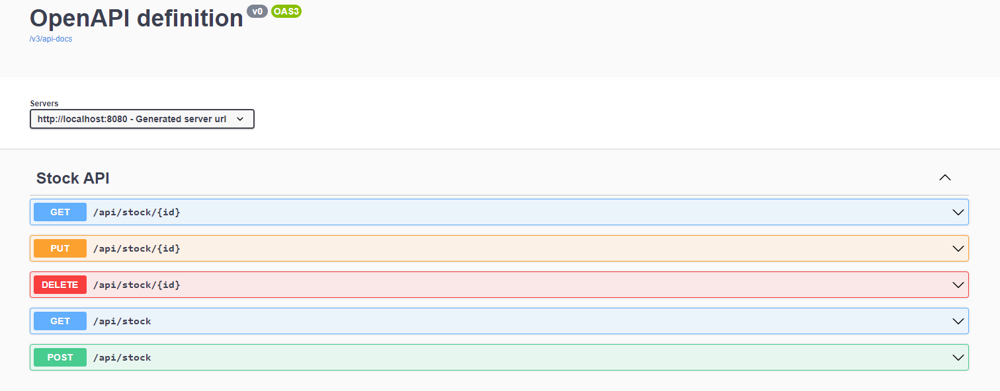

# Getting Started

### Introduction
This project is a sample project to have a simple **CRUD Rest API** running in Docker. 

The database is **MySQL**

### Requirements

* docker
* docker-compose
* Intellij IDEA

### Usage

1. Open project with Intellij IDEA and package application.
2. Compile image.

```
docker build -t api_sample .
```

3. Run the entire application.

```
docker compose up -d
```

4. Once application starts, you can access OpenAPI documentation at: http://localhost:8080/swagger-ui/index.html#/

